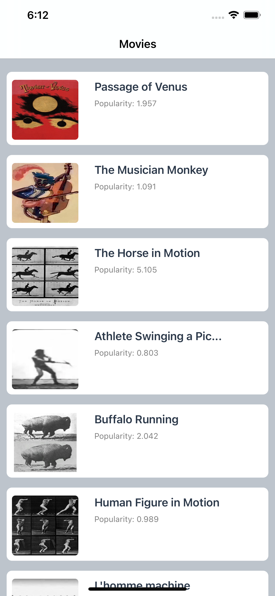

# Cinemagic

> Cinemagic is an iPhone app for discovering movies easily. The app displays movies list in the first screen. Clicking on one of the movies in the list, redirect you to the movie details. 

> Cinemagic  uses MVVM design pattern and Dependency Injection.  The TMDb API is used as data source. 

## Screenshots

 

## Requirements

- iOS 14.0+
- Swift 4

## Getting Started

1. Download the latest Xcode
2. Clone this repository
3. Install [Cocoapods](https://cocoapods.org)
4. Open Cinemagic.xcworkspace in Xcode

#### Third Party Libraries

1. SnapKit
2. Layoutless
3. RxSwift
4. RxCocoa
5. SwiftyJSON
6. RxTest

## LICENSE
This project is licensed under [ISC](https://opensource.org/licenses/ISC) license.

## Author

<a href="https://linkedin.com/in/alihewiagh37" target="_blank">Ali Algmaty</a> – alihewaigh@gmail.com
